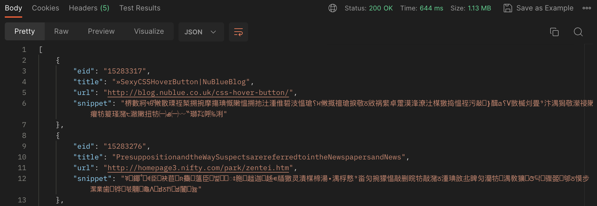
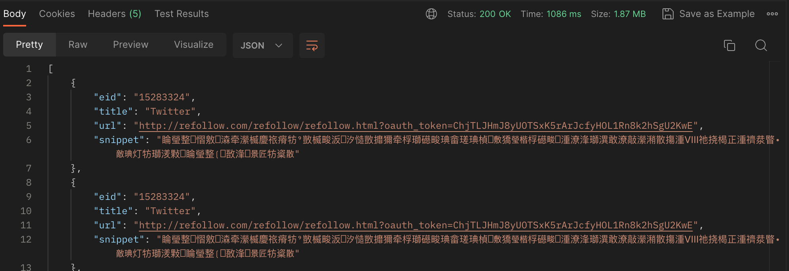

# 전문 검색엔진 구성

## 하테나 북마크 전문 검색 만들기

앞단에서 설명한 역인덱스와 이를 구성하는 `Dictionary`, `Postings`를 활용하여 실제 가상 검색 엔진을 구성해봅시다.

> [과제] 하테나 북마크에 작성된 최근 1만 건의 엔트리를 대상으로 한 전문 검색(제목, 내용) 엔진 만들기
>
> - 대상은 최근 엔트리 1만 건
> - 검색어를 포함하는 엔트리 반환
> - 반환 내용은 URL, 타이틀을 포함할 것
> - 가능하면 스니핏도 표시할 것
> - 작성일자순으로 정렬

예제 데이터의 형식은 다음과 같습니다.

```
15283325	5	http://www.hmv.co.jp/news/article/908110096/	矢野顕子名盤『akiko』をライヴ再現！｜ポップス｜ジャパニーズポップス｜音楽｜HMVONLINE　オンラインショッピング・情報サイト
15283324	2	http://refollow.com/refollow/refollow.html?oauth_token=ChjTLJHmJ8yUOTSxK5rArJcfyHOL1Rn8k2hSgU2KwE	Twitter
```

이는 왼쪽부터 엔트리ID(eid), 카테고리, URL, 타이틀을 의미합니다. 해당 [샘플 데이터](https://gihyo.jp/book/2010/978-4-7741-4307-1/support)는 여기서 다운로드
가능합니다.

## 직접 해보기

저자가 책에 작성한 모든 코드가 `Perl`로 작성되 있음으로 이후의 내용은 이를 그대로 `Spring-Kotlin`을 활용하는 형태로 변형하여 작성하였습니다.

### N-gram Tokenizer 구현

이중 포문, 조합 연산을 통해 `n-gram`을 구현할 수도 있지만, 여기까지 가면 너무 로우해짐으로 `lucene`에서 제공하는 `NGramTokenizer`를 활용하여 사용하겠습니다.

+) `lucene`은 아파치에서 제공하는 오픈 소스로 `ElasticSearch`에도 사용되고 있습니다.

```kotlin
fun nGramTokenizerTest() {
    val text = "Elasticsearch"
    val ngramTokens = performNgramTokenization(text, 2, 4)
    ngramTokens.forEach { println(it) }
}


fun performNgramTokenization(text: String, minGram: Int, maxGram: Int): List<String> {
    val tokenList = mutableListOf<String>()

    NGramTokenizer(minGram, maxGram).use { tokenizer ->
        tokenizer.setReader(StringReader(text))
        val charTermAttr: CharTermAttribute = tokenizer.addAttribute(CharTermAttribute::class.java)
        tokenizer.reset()
        while (tokenizer.incrementToken()) {
            val token = charTermAttr.toString()
            tokenList.add(token)
        }
        tokenizer.end()
        tokenizer.close()
    }

    return tokenList
}
```

- 출력 결과

```kotlin
El
Ela
Elas
la
las
last
        as
        ast
// ...
```

### 파일 읽어와서 역 인덱스 생성하기

역인덱스 테이블은 `key-value` 스토리지를 활용할것이기에 `map`자료 구조를 활용하였고, 이 또한 `VB Code`를 통해 압축할 것이기에 `<String, PriorityQeue>`형태의 맵으로
구성하였습니다.

```kotlin
fun makeInvetedIndex() {
    val map: MutableMap<String, PriorityQueue<String>> = mutableMapOf()
    val filePath = "src/main/resources/10entries.txt"
    val fileContent = readTextFile(filePath)
    fileContent.forEach {
        val ngramTokens = performNgramTokenization(it.title, 2, 3)
        ngramTokens.forEach { token ->
            if (map[token] == null) {
                map[token] = PriorityQueue<String>().apply { add(it.eid) }
            } else {
                map[token] = map[token]!!.apply { add(it.eid) }
            }
        }
    }

    map.forEach {
        println(it)
    }
}

fun readTextFile(filePath: String): List<HatenaEntry> {
    val file = File(filePath)
    val result = mutableListOf<HatenaEntry>()
    try {
        val bufferedReader = BufferedReader(InputStreamReader(FileInputStream(file), StandardCharsets.UTF_16))
        var line: String? = bufferedReader.readLine()

        while (line != null) {
            val splited = line.split("\t")
            if (splited.isNotEmpty()) {
                result.add(
                    HatenaEntry(
                        eid = splited[0],
                        categoryId = splited.getOrNull(1) ?: "",
                        url = splited.getOrNull(2) ?: "",
                        title = splited.getOrNull(3) ?: ""
                    )
                )
            }
            line = bufferedReader.readLine()
        }
        bufferedReader.close()
    } catch (e: Exception) {
        e.printStackTrace()
    }
    return result
}
```

출력 결과

```
情報サ=[15283325]
報サ=[15283325]
報サイ=[15283325]
サイ=[15283313, 15283316, 15283322, 15283325, 15283321]
サイト=[15283313, 15283316, 15283322, 15283325, 15283321]
イト=[15283313, 15283316, 15283322, 15283325, 15283321]
```

### 사용자 쿼리 진행

사용자의 쿼리 또한 `n-gram`으로 나누어서 진행합니다.

```kotlin
fun query() {
    val keyword = "動画まとめブログ" // 예시 쿼리
    val invertedIndex = makeInvetedIndex()
    val eidSet = mutableSetOf<String>()
    performNgramTokenization(keyword, 2, 3).forEach { token ->
        eidSet.addAll(invertedIndex[token] ?: emptyList())
    }

    eidSet.forEach {
        println(getContent(it))
    }
}

fun getContent(filePath: String): StringBuilder {
    val file = File("src/main/resources/texts/${filePath}")
    val result = StringBuilder()
    try {
        val bufferedReader = BufferedReader(InputStreamReader(FileInputStream(file), StandardCharsets.UTF_16LE))
        result.append(bufferedReader.readLines().take(10).joinToString { "${it}\n" })
        bufferedReader.close()
    } catch (e: Exception) {
        e.printStackTrace()
    }
    return result
}
```

출력 결과

```UTF_16LE
飦ꆝ菣ꒂ菣妗畯䙲汩䡥獯...
飦ꆝ菣ꒂ菣妗畯䙲...
飦ꆝ菣ꒂ菣妗畯䙲汩...
```

_글을 작성하는 에디터가 일본어와 인코딩 형식이 맞지 않아서 깨집니다.._

## Spring + MongoDB에 모의 검색 엔진 올려보기

위의 기능을 활용해 로컬서버에서 작동하는 모의 검색 엔진을 올려보겠습니다.

> 예제 소스는 [다음](https://github.com/dlgocks1/Search_Engine_Sample)에서 확인 가능합니다.

### MongoDB에 저장하기 위한 DTO 정의

모든 테이블의 정보를 가지고 있는 `HatenaEntry` 및 이에 대한 역 인덱스를 가질 테이블인 `InvertedIndex`
를 정의합니다.

```kotlin
import org.springframework.data.annotation.Id
import org.springframework.data.mongodb.core.mapping.Document

@Document
data class HatenaEntry(
    @Id
    val eid: String,
    val categoryId: String,
    val url: String,
    val title: String
)

@Document
data class InvertedIndex(
    @Id
    val term: String,
    val postings: List<String>
)
```

### 초기 모의 데이터 넣기

또한 초기 스프링을 실행할 때 역 인덱스 테이블과 기본 데이터베이스를 추가하는 소스를 추가합니다.

```kotlin
@Component
class DataInitializer(
    private val nGramTokenizer: NGramTokenizer,
    private val contentReader: ContentReader,
    private val invertedIndexRepository: InvertedIndexRepository,
    private val hatenaEntryRepository: HatenaEntryRepository
) : CommandLineRunner {

    @Throws(Exception::class)
    override fun run(vararg args: String) {
        hatenaEntryRepository.deleteAll()
        invertedIndexRepository.deleteAll()
        // 역 인덱스 저장
        invertedIndexRepository.saveAll(makeInvertedIndex().map {
            InvertedIndex(
                term = it.key,
                postings = it.value.toList()
            )
        })
        // eid를 키값으로하는 데이터 MongoDB에 저장
        hatenaEntryRepository.saveAll(contentReader.readMetaFile("src/main/resources/10000entries.txt"))
    }

    // 아래 소스는 제목에 대한 n-gram 토큰만을 역 인덱스로 저장합니다.
    private fun makeInvertedIndex(): Map<String, PriorityQueue<String>> {
        val map: MutableMap<String, PriorityQueue<String>> = mutableMapOf()
        val filePath = "src/main/resources/10000entries.txt"
        val fileContent = contentReader.readMetaFile(filePath)
        fileContent.forEach {
            val titleNgramTokens = nGramTokenizer.performNgramTokenization(it.title, 2, 3)
            titleNgramTokens.forEach { token ->
                if (map[token] == null) {
                    map[token] = PriorityQueue<String>().apply { add(it.eid) }
                } else {
                    map[token] = map[token]!!.apply { add(it.eid) }
                }
            }
        }
        return map
    }
}
```

### 쿼리 진행

이후 전체적인 플로우는 다음과 같습니다.

```kotlin
fun query(keyword: String): List<SearchResult> {
    // 1. 사용자의 검색어에 대한 n-gram을 도출합니다.
    val searchNgram = nGramTokenizer.performNgramTokenization(keyword, MIN_GRAM, MAX_GRAM)

    // 2. 역 인덱스 테이블에서 n-gram에 대한 모든 테이블을 가져옵니다.
    val invertedIndexes = invertedIndexRepository.findAllById(searchNgram)
    return invertedIndexes.mapNotNull { invertedIndex ->
        // 3. 역 인덱스 테이블에서 얻은 `eid`정보를 기반으로 데이터를 추출합니다.
        invertedIndex.postings.map { eid ->
            val hatenaEntry = hatenaEntryRepository.findByIdOrNull(eid)
            SearchResult(
                title = hatenaEntry?.title ?: "",
                url = hatenaEntry?.url ?: "",
                snippet = contentReader.getContent(eid) ?: ""
            )
        }
    }.flatten()
}
```

### 결과 보기

모든 테이블의 갯수는 `10_000`개 이며 생성된 역 인덱스는 약 `110_000`개 입니다.


---

- 'Amazon' 을 검색했을 때


`2506`개의 `Entry`가 반환됐으며, 소요시간은 약 `600ms`가 소비됐습니다.

---

- 'Twitter' 를 검색했을 때



`4373`개의 `Entry`가 반환됐으며, 소요시간은 약 `600ms`가 소비됐습니다.

단어에 인덱스가 걸려있긴 하지만, `MongoDB`를 활용했기에 `key-value`데이터 베이스를 활용한 것 보다 속도가 느리고, 더해 `content`에 대한 내용을 파일로부터 읽어오기에 속도가 느림을 알 수
있습니다.

## 더 생각해 볼 것

> - 대상은 최근 엔트리 1만 건
> - 검색어를 포함하는 엔트리 반환
> - 반환 내용은 URL, 타이틀을 포함할 것
> - 가능하면 스니핏도 표시할 것
> - 작성일자순으로 정렬

위의 MVP 기능만 제공하는 간단한 검색엔진이기에 더 생각해 볼 것이 남아 있습니다.

### 역 인덱스 테이블의 대한 압축

```json
// collection: invertedIndex
{
  "_id": "ﾞﾝﾄ",
  "postings": [
    "15275079",
    "15275119"
  ]
}
```

역 인덱스 테이블의 `postings`는 우선순위큐로 저장했음으로 정렬이 보장됩니다. 따라 이를 등차 값으로 저장하고 `VB Code`를 활용한다면 데이터베이스 용량을 절약할 수 있을 것입니다.

### AND / OR 쿼리문의 지원

쿼리를 분석하여 복수의 쿼리 단어를 얻었으면 각각의 쿼리 단어에 해당하는 `Postings`에 출현하는 공통 `eid`를 추출하여 AND 조건문이면 합집합을, OR 조건이면 교집합을 통해 구현할 수 있습니다.

### 형태소 분석의 사용

글의 제목과 내용에 대한 `2-gram`, `3-gram`을 활용한 역인덱스를 생성했을 때 역 인덱스 테이블의 갯수는 약 `360만개`, 용량은 `260Mb`를 차지하게 됩니다. 보다 효율적인 단어 분할이 필요합니다.

이에따라 `n-gram`이 아닌 한국어의 형태소 분석기를 활용하여 단어별로 형태를 분리하여 더 효율적인 역 인덱스를 형성할 수 있습니다.

### 카테고리 검색 + 스코어 링

`Query`를 통한 검색 뿐만 아니라 카테고리를 활용한 필터링을 지원할 수 있습니다.

- 카테고리 필터링 지원
    1. `query`를 통해 유효한 `postings`를 꺼내옵니다.
    2. `postings`중 카테고리와 동일한 포스팅을 필터링합니다.
    3. 결과를 정리하여 출력합니다.

해당 과정을 수행할 때는 `Lazy` 연산을 활용하여 효율적으로 수행할 수 있을 것입니다.
